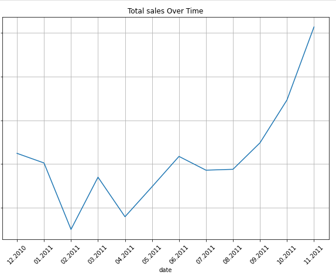
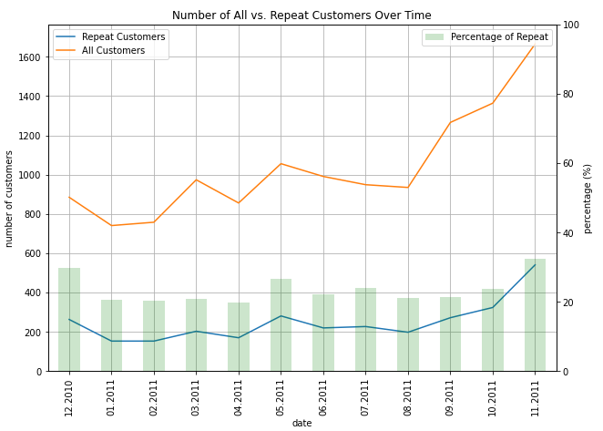
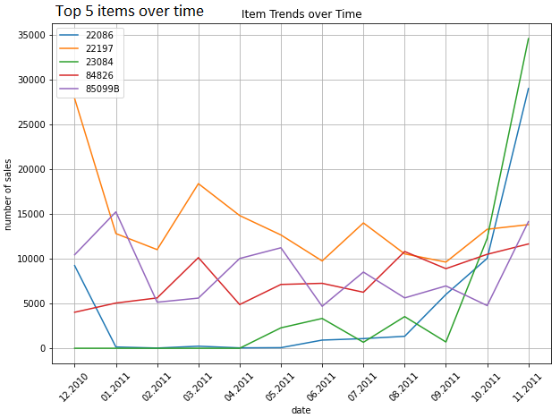
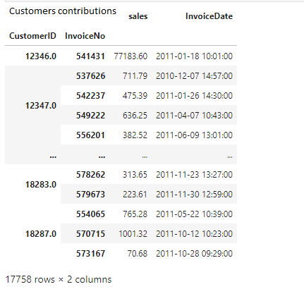

## Project 2: E-commerce Customer Behavior & Sales Trend Analysis

Analyzed a full year of e-commerce transaction data to understand customer purchasing behavior and identify product performance trends over time.

### Business Objectives
- Analyze repeat customer behavior and contribution to overall revenue  
- Identify best-selling product patterns and revenue drivers  
- Track monthly trends of popular products to support marketing and inventory decisions  

### Approach & Methodology
- Loaded and processed transactional dataset using Python (Pandas)  
- Conducted exploratory data analysis (EDA) to understand customer and product behavior  
- Performed time-based analysis to track monthly sales trends  
- Created visualizations to highlight key insights and patterns  

### Key Insights
- Repeat customers contributed significantly to total revenue  
- A small group of products consistently generated the highest sales volume  
- Clear seasonal/monthly fluctuations in product demand were observed  
- Product popularity shifted over time, indicating changing customer preferences  

<h3>Customer Segmentation Distribution</h3>

### Tools & Skills
Python, Pandas, Data Cleaning, Exploratory Data Analysis, Data Visualization

### Note
This project simulates real-world retail analytics used for marketing strategy and product performance optimization.
